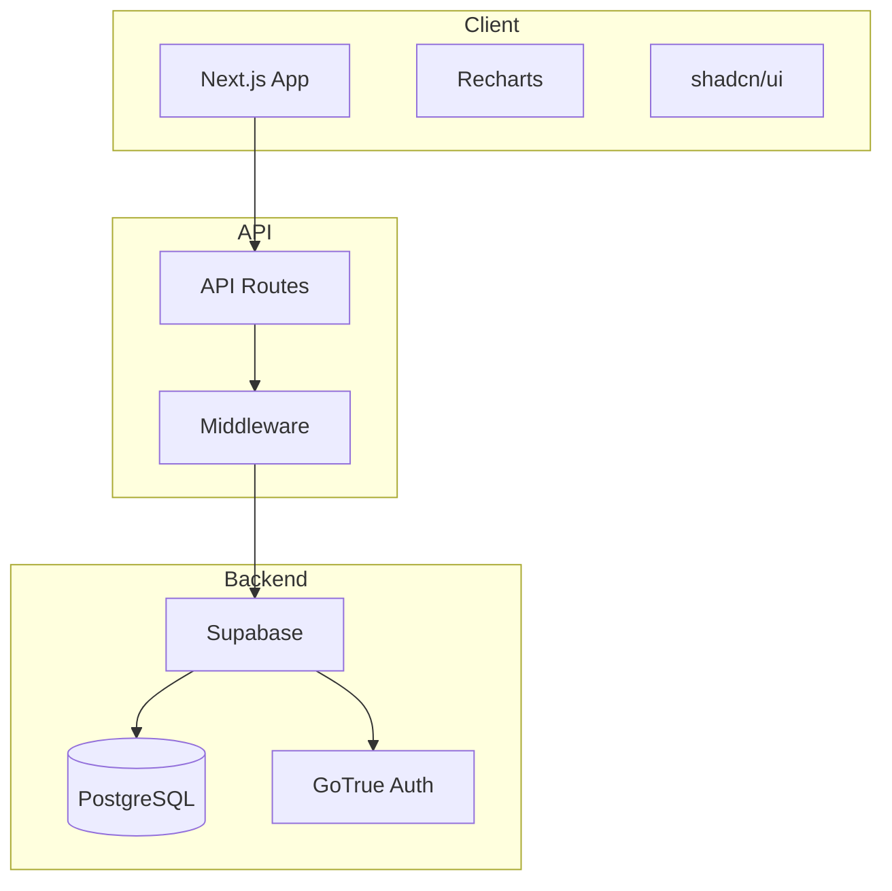
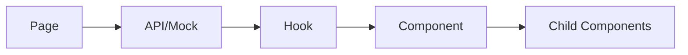

# Architecture Design Document (ADD)
## Aviation Intelligence Platform

### 1. System Architecture



---

### 2. Environment Architecture

| Environment | DB | App | Port |
|-------------|-----|-----|------|
| Development | Docker Supabase | Next.js dev | 3000 |
| Staging | Docker Supabase | Next.js dev | 3001 |
| Production | Self-hosted Supabase | Vercel | 443 |

---

### 3. Directory Structure

```
src/
├── app/                    # Next.js App Router
│   ├── (auth)/            # Auth route group
│   │   ├── login/
│   │   └── signup/
│   ├── (dashboard)/       # Protected dashboard
│   │   └── page.tsx
│   ├── api/               # API routes
│   │   └── models/
│   └── layout.tsx
├── components/
│   ├── ui/                # shadcn/ui components
│   │   ├── button.tsx
│   │   ├── card.tsx
│   │   ├── select.tsx
│   │   ├── table.tsx
│   │   └── tabs.tsx
│   ├── dashboard/         # Dashboard components
│   │   ├── metric-card.tsx
│   │   ├── charts/        # Chart components (split)
│   │   │   ├── price-distribution.tsx
│   │   │   ├── price-trend.tsx
│   │   │   ├── days-on-market.tsx
│   │   │   └── comparative.tsx
│   │   ├── signal-panel/  # Signal panel (split)
│   │   │   ├── index.tsx
│   │   │   ├── signal-item.tsx
│   │   │   └── signal-filters.tsx
│   │   └── aircraft-table/
│   │       ├── index.tsx
│   │       ├── columns.tsx
│   │       └── pagination.tsx
│   └── layout/
│       ├── header.tsx
│       └── model-selector.tsx
├── lib/
│   ├── supabase/
│   │   ├── client.ts
│   │   ├── server.ts
│   │   └── types.ts
│   ├── mock-data/         # Mock data (split by entity)
│   │   ├── models.ts
│   │   ├── metrics.ts
│   │   ├── distributions.ts
│   │   ├── trends.ts
│   │   ├── signals.ts
│   │   └── listings.ts
│   └── utils/
│       ├── format.ts
│       └── cn.ts
├── hooks/
│   ├── use-model.ts
│   └── use-metrics.ts
└── types/
    └── index.ts
```

---

### 4. Code Size Guidelines

> **Rule: No file > 350 lines**

#### Refactoring Triggers

| File Type | Split When |
|-----------|-----------|
| Component | >200 lines → extract sub-components |
| Hook | >100 lines → split by concern |
| Utils | >150 lines → split by domain |
| Types | >100 lines → split by entity |
| API Route | >150 lines → extract handlers |

#### Refactoring Patterns

**Large Component → Split by Concern**
```
SignalPanel.tsx (400 lines)
  ↓ refactor to:
signal-panel/
├── index.tsx         # Container + state (100 lines)
├── signal-item.tsx   # Single signal render (80 lines)
├── signal-filters.tsx # Filter controls (70 lines)
└── types.ts          # Local types (30 lines)
```

**Large Hook → Split by Feature**
```
useMetrics.ts (300 lines)
  ↓ refactor to:
hooks/
├── use-market-metrics.ts   # Metric cards (80 lines)
├── use-distributions.ts    # Chart data (80 lines)
├── use-signals.ts          # Signal data (80 lines)
└── use-listings.ts         # Table data (80 lines)
```

**Large Mock Data → Split by Entity**
```
mock-data.ts (500 lines)
  ↓ refactor to:
mock-data/
├── index.ts          # Re-exports (20 lines)
├── models.ts         # Aircraft models (40 lines)
├── metrics.ts        # Market metrics (80 lines)
├── distributions.ts  # Price/DOM buckets (60 lines)
├── trends.ts         # Historical prices (80 lines)
├── signals.ts        # Signal states (60 lines)
└── listings.ts       # Aircraft listings (120 lines)
```

---

### 5. Component Architecture

#### Props Pattern
```typescript
// Explicit props interface per component
interface MetricCardProps {
  title: string;
  value: string | number;
  change: number;
  trend: 'up' | 'down' | 'stable';
  tooltip?: string;
}
```

#### Data Flow


---

### 6. API Design

#### Endpoints

| Method | Path | Description |
|--------|------|-------------|
| GET | `/api/models` | List all models |
| GET | `/api/models/[id]` | Single model details |
| GET | `/api/models/[id]/metrics` | Market metrics |
| GET | `/api/models/[id]/distributions` | Price/DOM histograms |
| GET | `/api/models/[id]/trends` | Historical prices |
| GET | `/api/models/[id]/signals` | Signal states |
| GET | `/api/models/[id]/listings` | Aircraft listings |

#### Response Format
```typescript
interface APIResponse<T> {
  data: T;
  error?: string;
  meta?: { count: number; page: number; };
}
```

---

### 7. State Management

| State Type | Solution |
|------------|----------|
| Server State | React Query / SWR |
| UI State | React useState |
| Form State | React Hook Form |
| URL State | Next.js searchParams |

---

### 8. Security

| Layer | Implementation |
|-------|----------------|
| Auth | Supabase GoTrue |
| API | Middleware auth check |
| Database | Row Level Security |
| Client | httpOnly cookies |

---

### 9. Performance

| Technique | Application |
|-----------|-------------|
| Code Splitting | Dynamic imports for charts |
| Caching | React Query staleTime |
| Lazy Loading | Below-fold components |
| Skeleton UI | Loading states |
