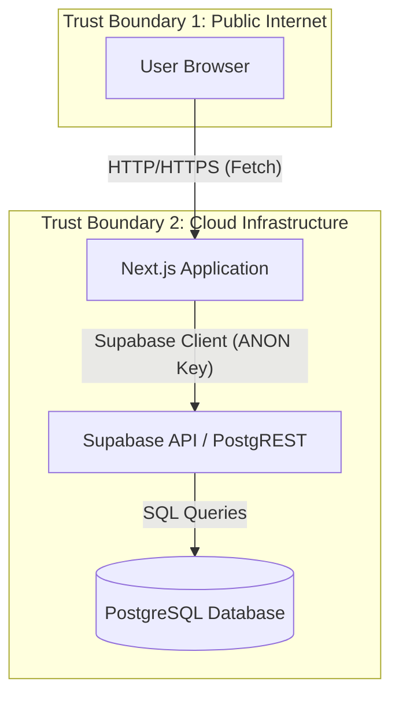

# Threat Model: Aircraft Dashboard Data Service

**Version**: 1.0
**Date**: 2025-01-22
**Owner**: Security Team / Engineering
**Review Cycle**: Quarterly

## Executive Summary

This threat model analyzes the **Aircraft Dashboard Data Service**, which provides market intelligence data (utilization, fleet age, etc.) to the user interface.

**Key Finding**: The database is currently exposed via the Supabase Client with the `ANON` key, but **Row Level Security (RLS) is not enabled** in the schema. This represents a **CRITICAL** risk allowing unauthorized users to potentially modify or delete market data.

**Threats Identified**: 7 (2 CRITICAL, 2 HIGH, 2 MEDIUM, 1 LOW)
**Action Required**: Immediate implementation of RLS policies.

## Architecture Overview

### Data Flow Diagram (DFD)

**Note**: In the current implementation (`src/services/dashboard.ts` importing `src/lib/supabase/client.ts`), the Supabase client is initialized with `NEXT_PUBLIC_SUPABASE_ANON_KEY`. Whether executed on Client or Server, this key allows access level determined by the database policies.

## STRIDE Analysis

### 🔴 SPOOFING THREATS

#### Threat S1: Unrestricted Database Access via ANON Key
**Scenario**: Attacker extracts `NEXT_PUBLIC_SUPABASE_ANON_KEY` and `NEXT_PUBLIC_SUPABASE_URL` from the client bundle and connects directly to the Supabase instance.
**Attack Vector**:
- Direct connection using Supabase JS client or REST API.
- Since RLS is NOT enabled, the `anon` role effectively acts as a superuser or owner for the public schema tables (depending on Postgres default privileges).
**Existing Mitigations**:
- ❌ None. RLS is disabled in `schema.sql`.
**Risk**: **CRITICAL**
- Likelihood: Certain (Key is public by design).
- Impact: High (Full access to data).

### 🔴 TAMPERING THREATS

#### Threat T1: Unauthorized Modification of Market Metrics
**Scenario**: Attacker uses the exposed ANON key to UPDATE or DELETE records in `aggregated_metrics`, `distributions`, or `signal_states`.
**Attack Vector**:
- `DELETE FROM aggregated_metrics WHERE model_id = ...`
- `UPDATE signal_states SET status = 'Negative' ...`
**Existing Mitigations**:
- ❌ None. RLS is disabled.
**Risk**: **CRITICAL**
- Likelihood: High.
- Impact: High (Data integrity loss, business reputation damage).

### 🔴 REPUDIATION THREATS

#### Threat R1: Unaccountable Data Changes
**Scenario**: Malicious changes (T1) occur, but cannot be traced to a specific user because all public access shares the same `anon` identity.
**Attack Vector**:
- Shared `anon` JWT token used for all public requests.
**Existing Mitigations**:
- ⚠️ Supabase logs API requests, but internal database logs might just show 'anon'.
**Risk**: **MEDIUM**
- Likelihood: High.
- Impact: Medium (Investigation difficulty).

### 🔴 INFORMATION DISCLOSURE THREATS

#### Threat I1: Bulk Data Scraping
**Scenario**: Competitor scrapes the entire dataset of all aircraft models, metrics, and proprietary "Signal States".
**Attack Vector**:
- `SELECT * FROM aircraft_models` via the API.
**Existing Mitigations**:
- ❌ No rate limiting observed on the specific endpoint level (Supabase global limits apply but are high).
- ❌ No authentication required to view data.
**Risk**: **HIGH**
- Likelihood: High.
- Impact: Medium (Loss of competitive advantage).

### 🔴 DENIAL OF SERVICE THREATS

#### Threat D1: API Quota Exhaustion
**Scenario**: Attacker floods the Supabase project with requests using the ANON key, exhausting the free/paid tier quotas and taking down the dashboard for legitimate users.
**Attack Vector**:
- Scripted high-frequency requests.
**Existing Mitigations**:
- ⚠️ Supabase platform-level protections (Basic).
**Risk**: **MEDIUM**
- Likelihood: Medium.
- Impact: High (Service availability).

### 🔴 ELEVATION OF PRIVILEGE THREATS

#### Threat E1: Schema Modification
**Scenario**: If the `anon` role has `CREATE` privileges on the `public` schema (often default in standard Postgres, though restricted in some Supabase configurations), an attacker could create new tables or functions to bypass logic.
**Existing Mitigations**:
- ⚠️ Depends on specific Supabase project config (not visible in code).
**Risk**: **LOW**
- Likelihood: Low.
- Impact: High.

#### Threat E2: Accessing Future/Hidden Features
**Scenario**: Attacker queries for data columns or tables that are not yet exposed in the UI (e.g., `manufactured_cost` if added later) but exist in DB.
**Existing Mitigations**:
- ❌ No mechanism to filter columns (Select * possible).
**Risk**: **HIGH** (Potential)

---

## 📊 THREAT SUMMARY

| Threat ID | Category | Risk | Status | Priority |
|-----------|----------|------|--------|----------|
| S1 | Spoofing | CRITICAL | 🔴 Open | P0 |
| T1 | Tampering | CRITICAL | 🔴 Open | P0 |
| I1 | Info Disclosure | HIGH | 🔴 Open | P1 |
| D1 | DoS | MEDIUM | 🟡 Partial | P2 |
| R1 | Repudiation | MEDIUM | 🔴 Open | P2 |

---

## 🎯 MITIGATION ROADMAP

### Immediate Actions (P0) - Day 1
1.  **Enable Row Level Security (RLS)**
    - Execute `ALTER TABLE <tablename> ENABLE ROW LEVEL SECURITY;` for all 4 tables.
2.  **Create Read-Only Policies**
    - Create policy allowing `SELECT` for `anon` role (public access) or `authenticated` (if auth required).
    - `CREATE POLICY "Public read access" ON aircraft_models FOR SELECT TO anon USING (true);`
3.  **Deny Write Access**
    - Ensure no policies exist for `INSERT`, `UPDATE`, `DELETE` for the `anon` role.

### Short Term (P1) - Week 1
1.  **Review `anon` Privileges**
    - Revoke `CREATE` on schema public from `anon`.
    - `REVOKE CREATE ON SCHEMA public FROM anon;`

### Medium Term (P2) - Month 1
1.  **Implement API Gateway / Server-Side Proxy**
    - Move Supabase calls to Next.js Server Actions or API routes.
    - Do not expose Supabase URL/ANON key to client if possible (though `client.ts` design suggests otherwise).
2.  **Rate Limiting**
    - Implement rate limiting in Next.js middleware.

## Validation Plan

1.  **Manual Verification**:
    - Attempt to `DELETE` a record using `curl` and the ANON key. Should fail after RLS enabled.
2.  **Automated Tests**:
    - Add integration test attempting unauthorized write.

## References
- [Supabase RLS Documentation](https://supabase.com/docs/guides/auth/row-level-security)
- [PostgreSQL Privileges](https://www.postgresql.org/docs/current/ddl-priv.html)
